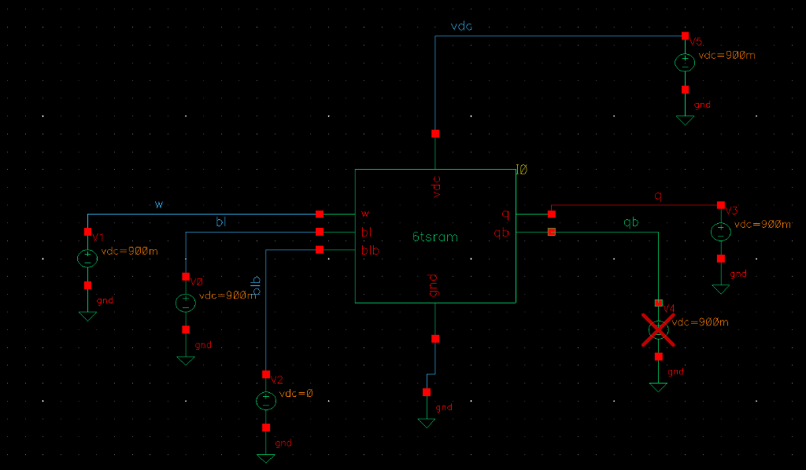
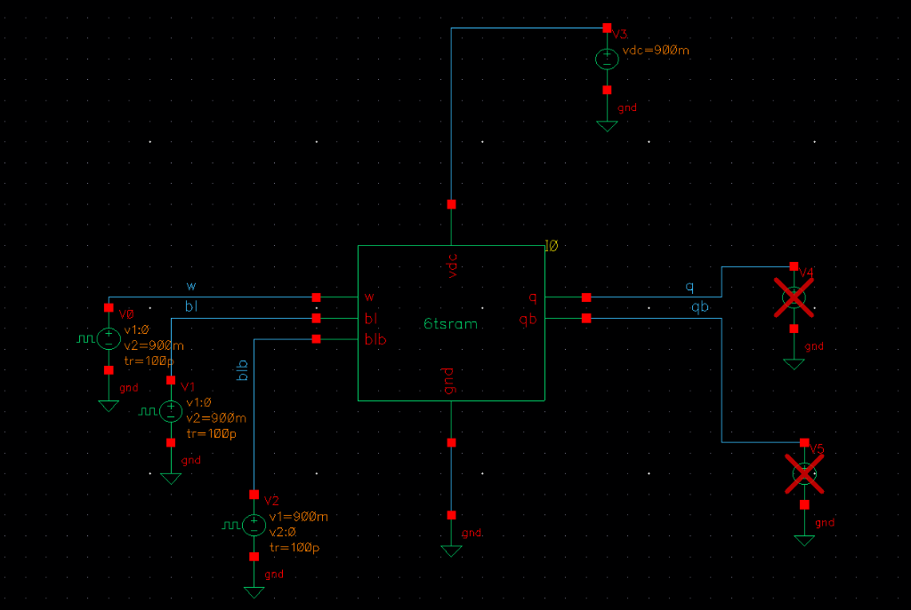

# 02. SPICE Characterization & Testbenches

This directory documents the Cadence Virtuoso testbench environments and simulation setups used for characterization across all 150 FinFET geometries and 8 supply voltages (1,200 SPICE simulations).

---

## 1. Hold Static Noise Margin (HSNM) Characterization
- **Simulation Type:** DC Voltage Sweep
- **Wordline:** Held at `WL = 0V` (Access transistors OFF).
- **Sweep:** Internal storage node voltage swept from `0V` to `VDD` to extract back-to-back Inverter Voltage Transfer Curves (VTCs).

| HSNM Testbench Schematic | Cadence ADE DC Butterfly Waveform |
| :---: | :---: |
|  |  |

---

## 2. Transient Write & Hold Characterization
- **Simulation Type:** Transient Dynamic Response (0 to 100 ns)
- **Wordline (WL):** Pulsed HIGH (`0V -> 900mV/1.2V`) for write cycles, held LOW (`0V`) for hold retention.
- **Bitlines (BL / BLB):** Driven differentially (`BL = 0V, BLB = VDD` for Write-0; `BL = VDD, BLB = 0V` for Write-1).
- **Measurement:** Wordline-to-internal-node 50%-to-50% switching propagation delay and dynamic energy integration.

| Write & Hold Testbench Schematic | Cadence ADE Transient Response Waveforms |
| :---: | :---: |
|  |  |

---

## 3. Automated Simulation Sweep Matrix
- **150 Cartesian Geometries** (`PU: 1-5`, `PD: 1-6`, `ACC: 1-5`)
- **8 Discrete Supply Voltages** (`0.7V, 0.8V, 0.9V, 1.0V, 1.1V, 1.2V, 1.3V, 1.4V`)
- **Total:** **1,200 Automated Cadence Spectre SPICE Netlist Simulations**.
