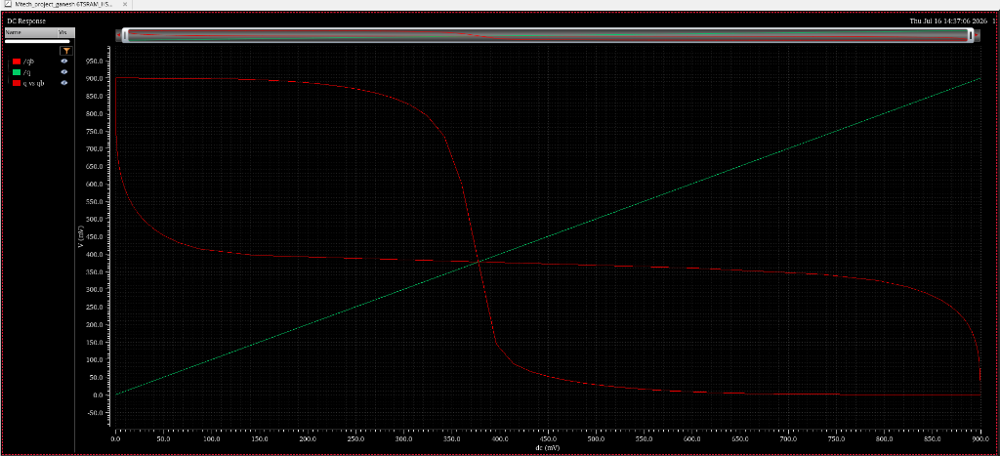
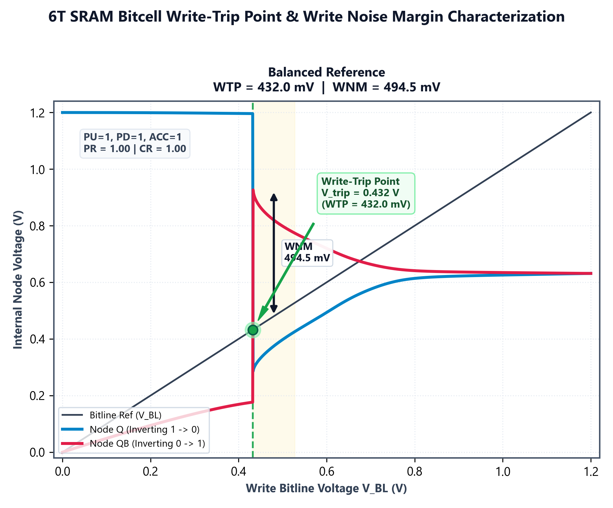
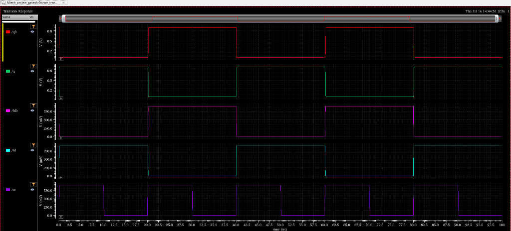

# 08. Results & Publication Figures

This directory contains the high-DPI publication figures, multi-objective Pareto-front projections, and Cadence Virtuoso verification waveforms.

---

## Verification Dashboard & Pareto Frontiers

| Verification Parity Dashboard | Multi-Objective Pareto-Front Tradeoffs |
| :---: | :---: |
|  |  |

---

## Static Noise Margin (SNM) Butterfly Curves & DC Transfer

| Unified SNM Butterfly Curves (Inscribed Squares) | Cadence ADE DC Butterfly Waveforms |
| :---: | :---: |
|  |  |

---

## Write Trip Point (WTP) & Write Noise Margin (WNM)

| 4-Profile WTP & WNM Dashboard | Single-Cell Focus (Balanced Reference) |
| :---: | :---: |
|  |  |

---

## Dynamic Transient Waveforms (Write Delay & Read Disturb)

| Python Publication Write Switching Transitions | Cadence ADE Multi-Cycle Write & Hold Transient Response |
| :---: | :---: |
|  |  |
