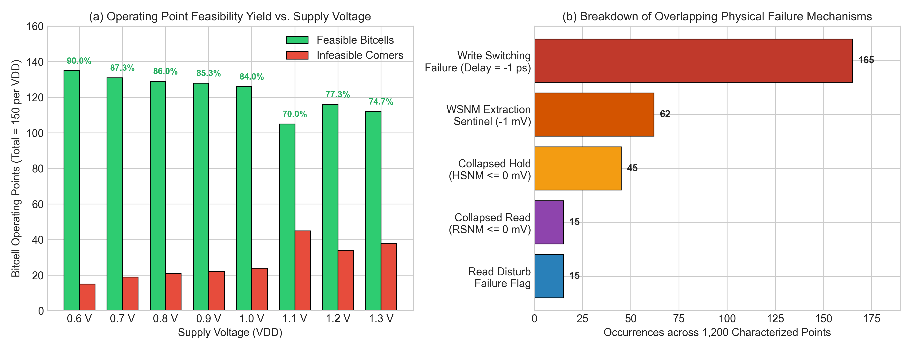
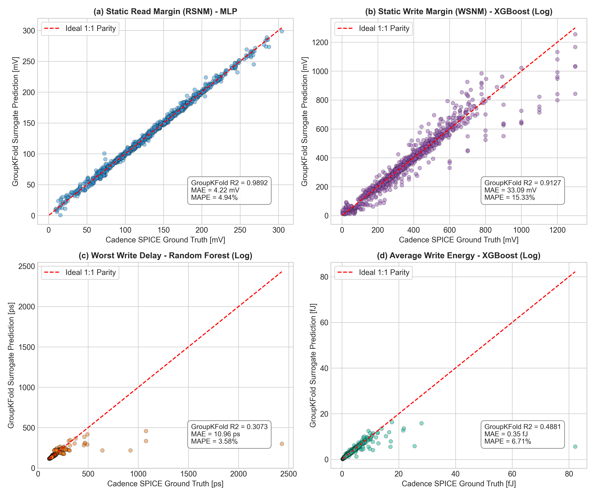
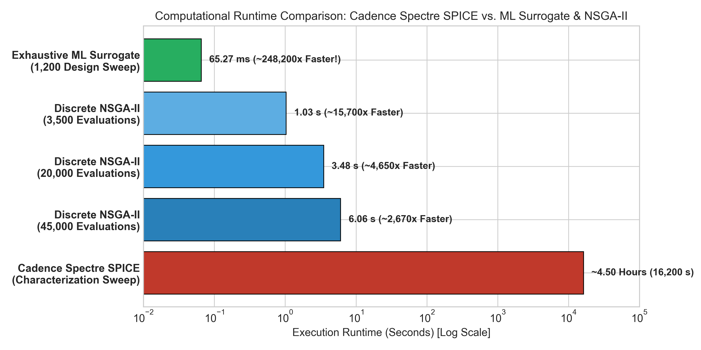
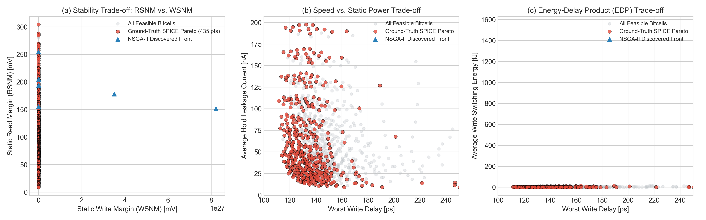
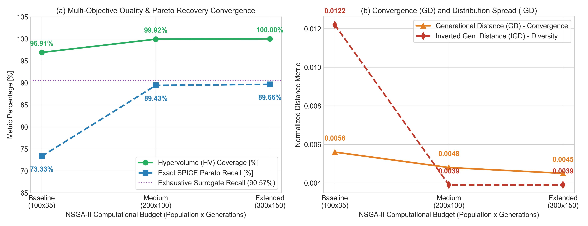
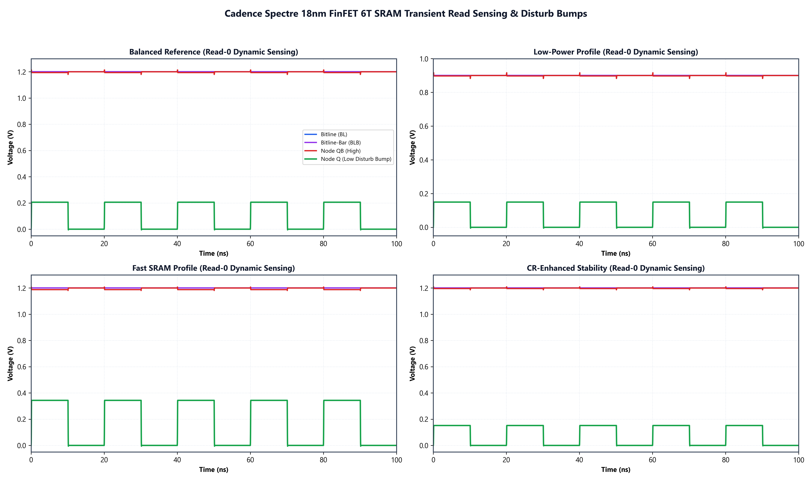

# 08. Results & Publication Figure Gallery

This directory contains high-DPI publication figures, multi-objective Pareto-front projections, ML surrogate validation plots, and raw Cadence Virtuoso ADE verification waveforms across all 150 FinFET geometries and 8 supply voltages.

---

## 1. 1,200-Point Characterization Feasibility & Failure Analysis

  

*Physical yield across supply voltages (0.6V to 1.3V) and occurrence breakdown of failure modes (write switching failure, WSNM sentinel, collapsed hold/read SNM, and read disturb flipping).*

---

## 2. GroupKFold ML Surrogate Generalization Parity Plots (Unseen Geometries)

  

*Parity verification comparing Cadence SPICE ground truth against ML surrogate predictions across 30 held-out physical bitcell geometries: (a) Static Read Margin (RSNM, R2 = 0.9892), (b) Static Write Margin (WSNM, R2 = 0.9127), (c) Worst Write Delay (MAE = 10.96 ps), and (d) Average Write Energy (MAE = 0.35 fJ).*

---

## 3. Computational Runtime Speedup Benchmark (SPICE vs. ML Surrogate)

  

*Quantifies the ~248,200x speedup achieved by the ML surrogate (65.27 ms for 1,200 points) compared to transistor-level Cadence Spectre SPICE (~4.50 hours).*

---

## 4. Multi-Objective Pareto-Optimal Tradeoff Frontiers

  

*Multi-dimensional trade-off projections across all 150 geometries @ 1.2V: Read Stability vs. Write Delay, Read Stability vs. Hold Leakage Current, and Write Speed vs. Dynamic Write Energy.*

---

## 5. Pareto Frontier Projections & Ground-Truth SPICE Recovery

  

*Overlay of the NSGA-II discovered non-dominated front against the 435 ground-truth SPICE Pareto designs.*

---

## 6. NSGA-II Multi-Objective Convergence & Generational Distance

  

*Evolutionary convergence scaling showing 100.0% Hypervolume (HV) coverage and rapid reduction in Inverted Generational Distance (IGD).*

---

## 7. Closed-Loop Cadence Transistor-Level Golden Validation Dashboard

  

*Transistor-level re-simulation parity check across all 4 golden application profiles showing absolute relative errors strictly below 1.0%.*

---

## 8. Unified Static Noise Margin (SNM) Butterfly Curves & Inscribed Squares

  

*Hold SNM (top row) and Read SNM (bottom row) butterfly curves with exact geometric inscribed squares for Balanced, Low-Power, Fast, and CR-Enhanced profiles.*

---

## 9. Write Trip Point (WTP) & Write Noise Margin (WNM) 4-Panel Dashboard

  

*DC write trip point transition sweeps displaying internal node voltages (Q and QB) and writeability margins.*

---

## 10. Dynamic Transient Write Delay Waveforms (50%-to-50% Switching)

  

*Time-domain dynamic write switching waveforms demonstrating sub-135 ps access delay for the Fast SRAM profile.*

---

## 11. Dynamic Transient Read Waveforms (Differential Sensing & Voltage Bump)

  

*Time-domain read access sensing and internal node disturb bump suppression across all 4 design profiles.*
