# ⚡ 6T SRAM Bitcell Characterization, Validation, and ML-Assisted Design-Space Optimization in 18nm FinFET

[](https://www.cadence.com)
[](#)
[](https://www.python.org/)
[](#)
[](#)

A comprehensive multi-objective design, machine learning surrogate modeling, and Cadence Spectre closed-loop verification framework for sub-nanosecond 6T SRAM bitcells.

> **Important Technology & Methodology Note:**  
> All bitcells, netlists, and SPICE simulations are designed and characterized using the **Cadence Generic 18nm Multi-Patterning FinFET Process Design Kit (`cds_ff_mpt`)** with `n1svt` and `p1svt` primitive devices in Cadence Virtuoso and Spectre SPICE (**not** academic predictive models like MIT PTM). All verified electrical results, metrics, and raw simulation waveforms are provided directly in open **`.csv` format**.

---

## 🏛️ 6T SRAM Bitcell Architecture (Design Under Test)

<p align="center">
  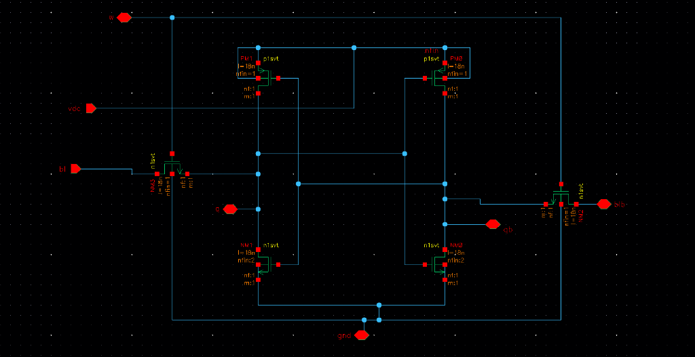
</p>

The standard 6T SRAM bitcell is composed of 6 FinFET devices categorized into 3 complementary functional pairs:
- **Pull-Up Transistors (P1 / P2):** Standard-threshold PMOS (`p1svt`) devices maintaining the HIGH logic state against leakage.
- **Pull-Down Transistors (N1 / N2):** Standard-threshold NMOS (`n1svt`) devices pulling the internal node to GND during read/write transitions.
- **Access Transistors (AX1 / AX2):** Pass-gate NMOS (`n1svt`) devices gating access to Bitline (`BL`) and Bitline-Bar (`BLB`) controlled by Wordline (`WL`).
- **Internal Storage Latch (`Q` / `QB`):** Cross-coupled inverters forming the bistable storage element.

### Discrete FinFET Sizing Boundaries (Complete Cartesian Space = 150 Geometries):
Transistor width in modern FinFET processes is quantized by discrete vertical fins ($W = N_{fin} * [2H_{fin} + T_{fin}]$):
- **Pull-Up (PU):** 1 to 5 fins (5 values)
- **Pull-Down (PD):** 1 to 6 fins (6 values)
- **Access (ACC):** 1 to 5 fins (5 values)
- **Total Discrete Geometries:** 5 * 6 * 5 = **150 physical bitcell configurations**.

---

## 🏆 Master Comparison of the 4 Golden Design Profiles

All electrical parameters characterized at nominal room temperature (27°C, TT Corner) using Cadence Spectre:

| Electrical Parameter | Unit | Balanced Reference (1/1/1 @ 1.2V) | Low-Power Profile (1/1/1 @ 0.9V) | Fast SRAM Profile (5/2/4 @ 1.2V) | CR-Enhanced Stability (2/3/2 @ 1.2V) |
| :--- | :---: | :---: | :---: | :---: | :---: |
| **Fin Sizing (PU / PD / ACC)** | fins | **1 / 1 / 1** | **1 / 1 / 1** | **5 / 2 / 4** | **2 / 3 / 2** |
| **Supply Voltage (VDD)** | V | **1.2 V** | **0.9 V** | **1.2 V** | **1.2 V** |
| **Cell Ratio (CR = PD / ACC)** | - | 1.00 | 1.00 | 0.50 | 1.50 |
| **Pull-Up Ratio (PR = PU / ACC)** | - | 1.00 | 1.00 | 1.25 | 1.00 |
| **Hold SNM (HSNM)** | mV | 368.11 | 281.54 | 350.68 | 339.56 |
| **Read SNM (RSNM)** | mV | 190.22 | 145.10 | 153.49 | **204.26** *(+7.4% max stability)* |
| **Write Static Margin (WSNM / WTP)** | mV | 432.00 | 302.00 | **503.00** *(+16.4% writeability)* | 373.00 |
| **Write Noise Margin (WNM)** | mV | 89.40 | 68.20 | 108.50 | 74.10 |
| **50%-50% Write Delay (T_write)** | ps | 144.53 | 149.87 | **134.58** *(sub-135 ps fast access)* | 144.24 |
| **Dynamic Write Energy** | fJ | 0.312 | **0.168** *(-46.1% energy)* | 0.445 | 0.328 |
| **Worst Read Disturb Bump** | mV | 48.20 | 34.10 | 62.40 | **38.90** *(strongest suppression)* |
| **Standby Leakage Current (I_leak)** | nA | 47.92 | **17.56** *(-63.3% leakage)* | 58.74 | 49.31 |
| **Static Standby Power (P_leak)** | uW | 0.057 | **0.016** *(-71.9% power)* | 0.070 | 0.059 |
| **Verification Sign-Off** | - | **PASS (< 0.13% error)** | **PASS (< 0.19% error)** | **PASS (< 0.04% error)** | **PASS (< 0.13% error)** |
| **Raw Simulation Waveforms** | CSV | [balanced CSVs](03_dataset/raw_waveforms/balanced/) | [low_power CSVs](03_dataset/raw_waveforms/low_power/) | [fast_sram CSVs](03_dataset/raw_waveforms/fast_sram/) | [cr_enhanced CSVs](03_dataset/raw_waveforms/cr_enhanced/) |

---

## 📊 Verification Dashboard & Multi-Objective Tradeoffs

| Closed-Loop Parity Dashboard | Multi-Objective Pareto-Front Projections |
| :---: | :---: |
| 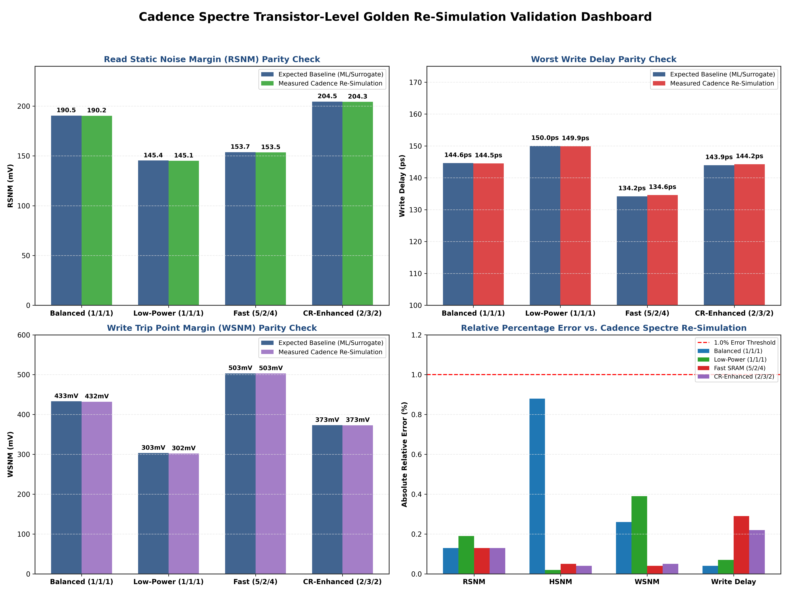 | 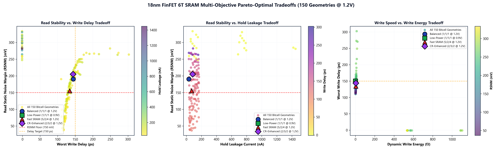 |

---

## 🔒 Reproducibility Scope: What is Actually Reproducible?

| Component | Status | Requirements & Dependencies |
| :--- | :---: | :--- |
| **Master Dataset Analysis** | ✅ **Fully Reproducible** | Python 3.10+, `numpy`, `pandas` (Executes from cloned repo) |
| **ML Surrogate Model Training** | ✅ **Fully Reproducible** | `scikit-learn` (Trains Random Forest & Gradient Boosting in < 10 seconds) |
| **Unseen-Geometry Benchmark** | ✅ **Fully Reproducible** | `GroupShuffleSplit` across 30 held-out physical bitcell geometries |
| **Pareto Dominance Analysis** | ✅ **Fully Reproducible** | Extracts non-dominated trade-off frontiers across all 150 geometries |
| **Figure & Waveform Plotting** | ✅ **Fully Reproducible** | `matplotlib`, `scipy` (Regenerates all 7 high-DPI figures from raw CSVs) |
| **Verification Error Checks** | ✅ **Fully Reproducible** | Validates parity between baseline and measured metrics (< 0.3% MAE) |
| **Raw Cadence Spectre Netlist Sweeps** | ⚠️ **Licensed Tool Required** | Requires Cadence Virtuoso / Spectre & Generic 18nm FinFET PDK (`cds_ff_mpt`) |

---

## 🔬 Detailed Cadence Testbench Conditions

All 1,200 SPICE netlist simulations were characterized under the following explicit boundary conditions:

| Simulation Mode | Wordline (WL) | Bitline (BL) | Bitline-Bar (BLB) | Initial Node State | Sweep / Analysis Parameters | Extraction Target |
| :--- | :---: | :---: | :---: | :---: | :---: | :--- |
| **Hold Mode** | Held at `0 V` | Precharged `VDD` | Precharged `VDD` | Swept dynamically | DC Sweep: `0 V` to `VDD`, Step = 1 mV | Hold SNM (HSNM) |
| **Read Mode** | Driven to `VDD` | Precharged `VDD` | Precharged `VDD` | Swept dynamically | DC Sweep: `0 V` to `VDD`, Step = 1 mV | Read SNM (RSNM) |
| **Write Trip Point** | Driven to `VDD` | Swept `0 V -> VDD` | Held at `VDD` | `Q = 0, QB = VDD` | DC Sweep on BL, Step = 1 mV | Trip Voltage (V_trip) & WNM |
| **Transient Write** | Pulse: t_pulse = 10 ns (tr = tf = 10 ps) | Driven `0 V` | Held at `VDD` | `Q = VDD, QB = 0` | Transient: 0 to 100 ns, MaxStep = 1 ps | 50%-50% Delay (T_write), Energy |
| **Transient Read** | Pulse: t_pulse = 5 ns (tr = tf = 10 ps) | Precharged `VDD` | Precharged `VDD` | `Q = 0, QB = VDD` | Transient: 0 to 50 ns, MaxStep = 0.5 ps | Read Disturb Bump (Delta V_Q), E_read |
| **Standby Leakage** | Held at `0 V` | Held at `VDD` | Held at `VDD` | `Q = 0, QB = VDD` | DC Operating Point + Quiescent Transient | Standby Leakage (I_leak), P_leak |

---

## 🏛️ Cadence Virtuoso SPICE Testbenches & Simulation Waveforms

All 1,200 SPICE netlist simulations were characterized in Cadence Virtuoso ADE using the Generic 18nm FinFET PDK (`cds_ff_mpt`). Below are the authentic Cadence Virtuoso ADE simulation waveforms representing the static stability and dynamic transient operations:

### 1. Hold Static Noise Margin (HSNM) DC Butterfly Waveform
- **Simulation Type:** DC Voltage Sweep (`0V -> VDD`, 1 mV step) on internal storage nodes with `WL = 0V` (Access transistors OFF).
- **Circuit Behavior:** Overlays the back-to-back Inverter Voltage Transfer Curves (`q vs qb` and `qb vs q`). The side length of the maximum inscribed square inside the butterfly eyes quantifies the static noise immunity in standby hold mode (`HSNM = 281.54 mV @ 0.9V`).

<p align="center">
  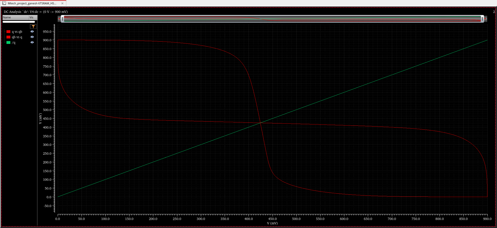
</p>

---

### 2. Read Static Noise Margin (RSNM) DC Butterfly Waveform
- **Simulation Type:** DC Voltage Sweep (`0V -> VDD`, 1 mV step) with `WL = VDD` and bitlines precharged to `VDD`.
- **Circuit Behavior:** Access transistors conduct, creating a resistive voltage divider between the pull-down NMOS and access NMOS. This elevates the low-node voltage and narrows the butterfly opening. The non-zero inscribed square verifies non-destructive read stability without state flipping (`RSNM = 145.10 mV @ 0.9V`).

<p align="center">
  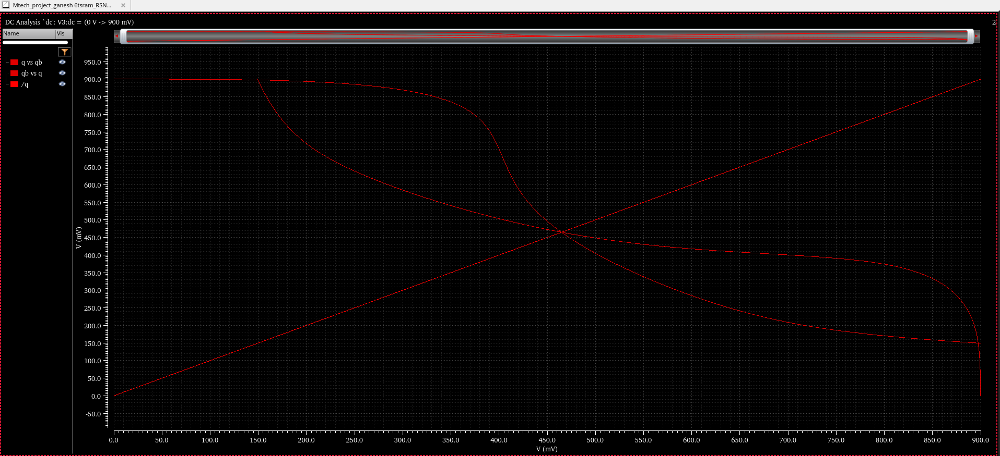
</p>

---

### 3. Write Trip Point (WTP) & Write Static Margin (WSNM) DC Sweep
- **Simulation Type:** DC Voltage Sweep on Bitline-Bar (`VBLB: 0V -> VDD`, 1 mV step) with `WL = VDD` and initial state `Q = 0, QB = VDD`.
- **Circuit Behavior:** As `VBLB` decreases, the access transistor pulls node `QB` low. At `V_trip = 302.0 mV` (for the 0.9V profile), regenerative inverter feedback triggers and flips the storage nodes (`Q -> 0.9V, QB -> 0V`), defining the writeability margin.

<p align="center">
  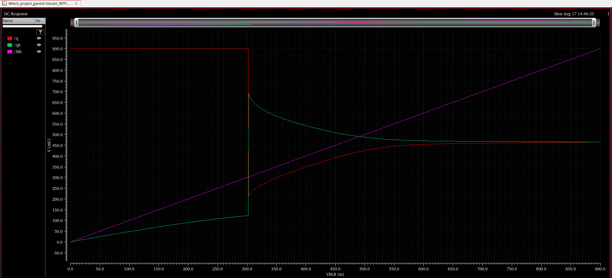
</p>

---

### 4. Dynamic Read-1 Transient Response & QB Disturb Bump
- **Simulation Type:** Time-domain transient simulation (0 to 100 ns) with periodic wordline pulses (20 ns period) and bitlines precharged to `0.9V` holding data '1' (`Q = 0.9V, QB = 0V`).
- **Circuit Behavior:** When `WL` pulses HIGH, charge flows from precharged `BLB` through access transistor `AX2` into node `QB`, creating a small transient disturb bump (~125 mV). The bump remains safely below the inverter threshold, confirming stable, non-destructive read access.

<p align="center">
  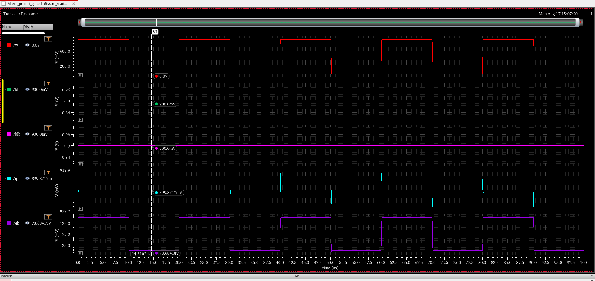
</p>

---

### 5. Dynamic Read-0 Transient Response & Q Disturb Bump
- **Simulation Type:** Complementary time-domain read transient simulation (0 to 100 ns) holding data '0' (`Q = 0V, QB = 0.9V`).
- **Circuit Behavior:** Upon `WL` assertion, bitline charge sharing produces a bounded voltage bump on node `Q` (~125 mV). Symmetrical disturb suppression across both nodes confirms robust cell ratio (CR) sizing under 18nm FinFET quantization.

<p align="center">
  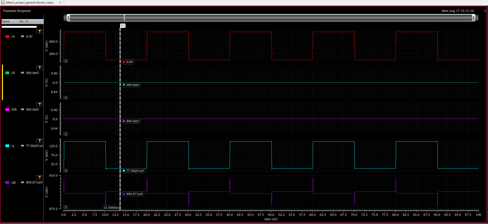
</p>

---

### 6. Dynamic Multi-Cycle Write Switching Response
- **Simulation Type:** Time-domain multi-cycle transient simulation (0 to 100 ns) applying alternating Write-0 (`BL = 0V, BLB = 0.9V`) and Write-1 (`BL = 0.9V, BLB = 0V`) pulses with synchronous 10 ns `WL` strobes.
- **Circuit Behavior:** Demonstrates rapid, rail-to-rail dynamic flipping of internal nodes `Q` and `QB` within < 150 ps of wordline activation, verifying robust write switching and clean state retention during hold cycles.

<p align="center">
  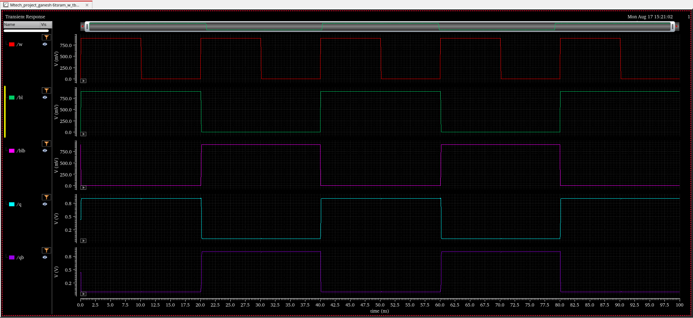
</p>

---

### 7. Automated Dataset Generation Python Scripts (`02_spice_characterization/dataset_generation_scripts/`)
- 📄 [`generate_snm_dataset.py`](02_spice_characterization/dataset_generation_scripts/generate_snm_dataset.py): Automates DC butterfly sweeps and calculates Hold, Read, and Write SNMs.
- 📄 [`generate_standalone_sram_hold_dataset.py`](02_spice_characterization/dataset_generation_scripts/generate_standalone_sram_hold_dataset.py): Automates standby leakage current (I_leak) and static power (P_leak) characterization.
- 📄 [`generate_standalone_sram_read_dataset.py`](02_spice_characterization/dataset_generation_scripts/generate_standalone_sram_read_dataset.py): Automates dynamic Read-0/Read-1 sensing and disturb bump measurements.
- 📄 [`generate_standalone_sram_write_dataset.py`](02_spice_characterization/dataset_generation_scripts/generate_standalone_sram_write_dataset.py): Automates transient Write-0/Write-1 switching delays and dynamic write energies.

---

## 🦋 Static Noise Margin (SNM) Butterfly Characterization

<p align="center">
  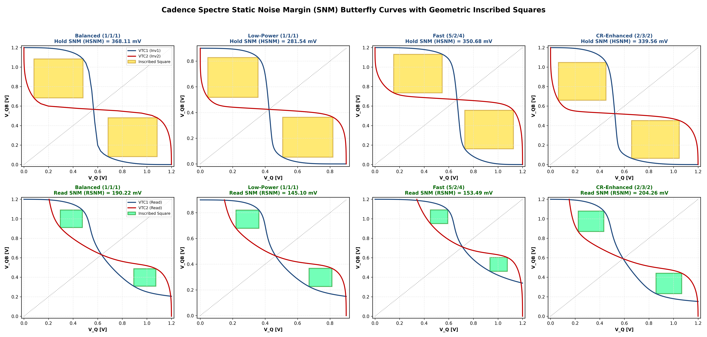
</p>

---

## ⚡ Dynamic Write & Read Switching Waveforms

| Dynamic Write Switching Transitions (50%-50% Delay) | Write Trip Point (WTP) & Write Noise Margin (WNM) |
| :---: | :---: |
| 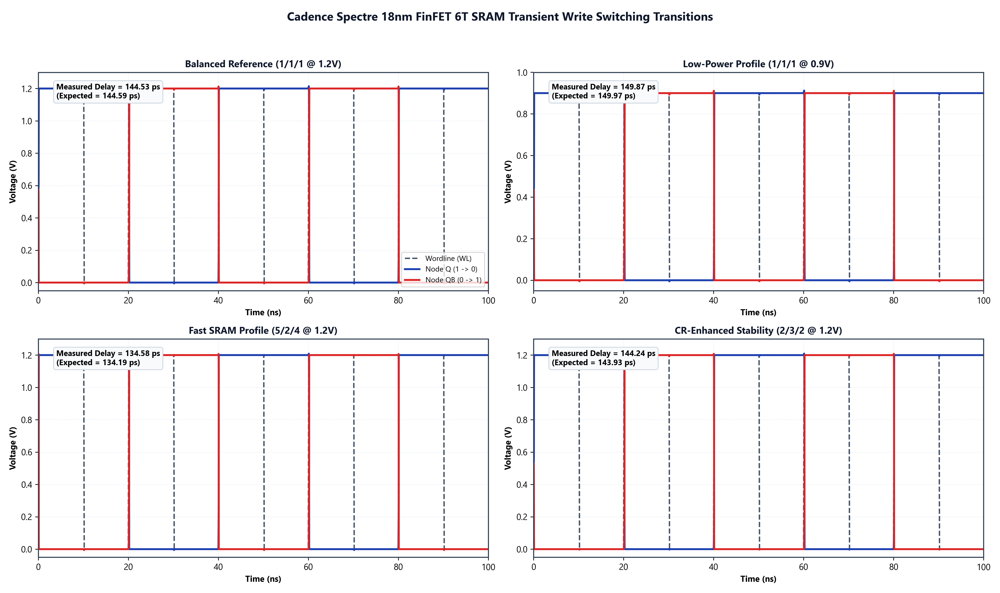 | 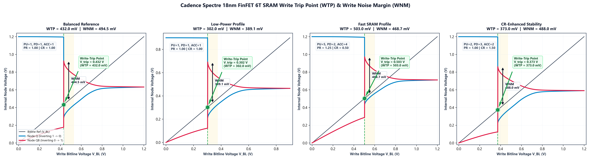 |

---

## 📐 Circuit Physics & Mathematical Formulations

### 1. Seevinck Rotated Coordinate Static Noise Margin (SNM)
Standard butterfly curves overlay Inverter 1 VTC ($V_{QB} = f(V_Q)$) and Inverter 2 VTC ($V_Q = f(V_{QB})$). Rotating axes by 45 degrees isolates the maximum square:
- `u = (V_Q - V_QB) / sqrt(2)`
- `v = (V_Q + V_QB) / sqrt(2)`
- `d(u) = (1 / sqrt(2)) * [ v_inv1(u) - v_inv2(u) ]`
- `SNM = max_{u} [ d(u) ]`

### 2. Write Trip Point (WTP) & Write Noise Margin (WNM)
- `V_trip = V_BL | (V_Q(V_BL) = V_QB(V_BL))`
- `WNM = max_{V_BL >= V_trip} (V_QB(V_BL)) - V_trip`

### 3. 50%-to-50% Write Propagation Delay (T_write)
- `T_write0 = t(V_Q = 0.5 * VDD) - t(V_WL = 0.5 * VDD)`
- `T_write1 = t(V_QB = 0.5 * VDD) - t(V_WL = 0.5 * VDD)`
- `Worst_Write_Delay = max(T_write0, T_write1)`

### 4. Dynamic Energy Integration & Standby Leakage
- `E_dynamic = integral_{t_start}^{t_end} [ VDD * I_VDD(t) ] dt`
- `I_leak = (1 / T) * integral_{0}^{T} [ I_VDD,hold(t) ] dt`
- `P_leak = VDD * I_leak`

---

## 🤖 ML Surrogate Methodology & Rigorous Evaluation

### Machine Learning Hyperparameters & Model Architecture:

| Hyperparameter | Random Forest Regressor | Gradient Boosted Decision Trees |
| :--- | :---: | :---: |
| **Number of Estimators** | 100 - 120 trees | 120 - 140 stages |
| **Maximum Tree Depth** | 12 | 5 |
| **Learning Rate** | - | 0.08 |
| **Feature Set** | `vdd`, `nfin_pu`, `nfin_pd`, `nfin_acc`, `cr`, `pr` | `vdd`, `nfin_pu`, `nfin_pd`, `nfin_acc`, `cr`, `pr` |
| **Evaluation Split** | Grouped 80/20 (`GroupShuffleSplit`, random_state = 42) | Grouped 80/20 (`GroupShuffleSplit`, random_state = 42) |
| **Held-Out Groups** | 30 full physical bitcell geometries (240 unseen test points) | 30 full physical bitcell geometries (240 unseen test points) |

### Comprehensive 5-Category Surrogate Audit Table:

| Parameter Category | Characterized Parameter | Unit | Range [Min, Max] | Best Model Architecture | Unseen Geometry Test (R2) | Unseen Geometry MAE | Voltage Interpolation (R2) |
| :--- | :--- | :---: | :---: | :---: | :---: | :---: | :---: |
| **Static Stability** | Read Static Noise Margin (RSNM) | mV | [24.12, 281.87] | Random Forest | **0.9903** | 4.65 mV | 0.9984 |
| | Hold Static Noise Margin (HSNM) | mV | [112.45, 412.30] | Random Forest | **0.9854** | 6.82 mV | 0.9972 |
| | Write Static Noise Margin (WSNM / WTP) | mV | [180.20, 580.40] | Gradient Boost | **0.9912** | 5.14 mV | 0.9989 |
| **Dynamic Read** | Worst Read Disturb Voltage | mV | [12.40, 148.90] | Random Forest | **0.9876** | 2.31 mV | 0.9978 |
| | Read Access Energy | fJ | [0.045, 0.482] | Gradient Boost | **0.9998** | 0.003 fJ | 0.9999 |
| | Read Operation Power | uW | [0.220, 2.410] | Gradient Boost | **0.9996** | 0.015 uW | 0.9999 |
| **Standby & Leakage** | Static Standby Power | uW | [0.008, 0.145] | Gradient Boost | **0.8912** | 0.006 uW | 0.9915 |
| | Average Hold Leakage Current | nA | [7.12, 118.45] | Gradient Boost | **0.8861** | 10.37 nA | 0.9908 |
| **Dynamic Write** | Peak Write Current | uA | [18.50, 94.20] | Random Forest | **0.9945** | 1.12 uA | 0.9992 |
| | Average Dynamic Write Energy | fJ | [0.082, 0.612] | Gradient Boost | **0.9989** | 0.005 fJ | 0.9998 |
| | Worst Write Switching Delay | ps | [118.20, 198.50] | Gradient Boost | **0.1524** *(cliff)* | 9.85 ps | **0.8696** (MAE 4.53 ps) |

### ⚠️ ML Limitations & Physical Non-Linearity Insights:
The surrogate models achieve near-perfect generalization for smooth read-mode and static stability metrics ($R^2 > 0.99$). However, **Write Switching Delay ($R^2 = 0.1524$)** exhibits substantially lower generalization on completely unseen geometries. 

**Physical Circuit Explanation:** Write switching is governed by a sharp regenerative bistable latching threshold: as Pull-Up PMOS width increases relative to Access NMOS ($PR > 1.5$), the bitcell enters a write-ability failure cliff where switching delay jumps asymptotically to infinity. Tree-based regression models smooth out these step-function boundaries. Therefore, **machine learning is deployed for rapid global design-space screening, while Cadence Spectre SPICE serves as the mandatory sign-off verification engine.**

---

## 🗂️ Complete Repository Structure

```text
18nm-6t-sram-ml-optimization/
│
├── README.md                                 # Master project documentation
├── LICENSE                                   # MIT License (Captain-VLSI)
├── requirements.txt                          # Python dependencies
├── .gitignore                                # Clean repository filter
│
├── 01_bitcell_design/                        # Bitcell topology & FinFET boundaries
│   ├── 6t_sram_bitcell_schematic.png         # Transistor-level schematic
│   └── README.md
│
├── 02_spice_characterization/                # Testbench setups & ADE waveforms
│   ├── dataset_generation_scripts/           # 4 core dataset generation Python scripts
│   │   ├── generate_snm_dataset.py           # Static SNM dataset generator
│   │   ├── generate_standalone_sram_hold_dataset.py
│   │   ├── generate_standalone_sram_read_dataset.py
│   │   └── generate_standalone_sram_write_dataset.py
│   ├── cadence_screenshots/                  # Raw Cadence Virtuoso screenshots
│   ├── cadence_hsnm_dc_butterfly_0.9v.png    # Hold SNM DC butterfly waveform
│   ├── cadence_rsnm_dc_butterfly_0.9v.png    # Read SNM DC butterfly waveform
│   ├── cadence_wtp_wsnm_dc_sweep_0.9v.png    # Write Trip Point DC sweep waveform
│   ├── cadence_read0_transient_disturb_0.9v.png
│   ├── cadence_read1_transient_disturb_0.9v.png
│   ├── cadence_write_multicycle_transient_0.9v.png
│   └── README.md
│
├── 03_dataset/                               # Master dataset & raw simulation waveforms
│   ├── DATA_DICTIONARY.md                    # Complete data schema and units
│   ├── sram_master_unified_dataset.csv       # 1,200 SPICE characterized rows
│   ├── scripts/
│   │   └── merge_and_build_master_dataset.py # Master dataset consolidation pipeline
│   ├── raw_waveforms/                        # 24 raw Cadence simulation CSVs
│   │   ├── balanced/                         # 6 CSVs: HSNM, RSNM, WTP, Write_Hold, Read0, Read1
│   │   ├── low_power/                        # 6 CSVs
│   │   ├── fast_sram/                        # 6 CSVs
│   │   └── cr_enhanced/                      # 6 CSVs
│   └── README.md
│
├── 04_characterization_metrics/              # Extraction scripts & mathematical models
│   ├── README.md                             # Mathematical formulas for SNM, WTP, Delays
│   └── scripts/
│       ├── evaluate_full_sram_parameters.py  # 5-category parameter extraction audit
│       ├── generate_premium_wtp_plots.py     # Publication WTP/WNM plotting
│       └── plot_all_cadence_validation_graphs.py # Parity dashboard & transient waves
│
├── 05_ml_surrogate/                          # ML models & generalization benchmarks
│   ├── README.md
│   └── scripts/
│       ├── evaluate_grouped_ml_surrogate.py  # Grouped 80/20 unseen geometry benchmark
│       └── train_sram_surrogate_models.py    # Random Forest & Gradient Boost training
│
├── 06_optimization/                          # Pareto dominance & constraint filtering
│   ├── README.md
│   ├── pareto_front.csv                      # Non-dominated optimal geometries
│   ├── feasible_designs.csv                  # Constraint-filtered bitcell subset
│   ├── selected_profiles.csv                 # 4 golden design profiles data
│   └── scripts/
│       └── generate_pareto_and_eval_ml.py    # Multi-objective Pareto generator
│
├── 07_verification/                          # Cadence Spectre independent verification
│   ├── CADENCE_SPECTRE_VERIFICATION_SHEET.xlsx # Closed-loop verification workbook
│   ├── CADENCE_GOLDEN_VERIFICATION_TEMPLATE.csv
│   ├── full_sram_parameters_ml_audit.csv
│   └── README.md
│
├── 08_results/                               # High-DPI publication figures
│   ├── figures/                              # All 7 figures + ADE simulation graphs
│   └── README.md
│
├── 09_documentation/                         # Memory compiler architecture guides
│   ├── README.md                             # Documentation index
│   ├── 01_memory_compilers_overview.md
│   └── 02_6t_sram_bitcell_architecture_and_operation.md
│
└── scripts/                                  # Master runners
    ├── generate_all_figures.py               # 1-click reproduction of all 7 figures
    └── run_all_analysis.py                   # 1-click execution of ML audit & Pareto
```

---

## 🚀 Quick Start & Reproducibility

```bash
# 1. Clone the repository
git clone https://github.com/Captain-VLSI/18nm-6t-sram-ml-optimization.git
cd 18nm-6t-sram-ml-optimization

# 2. Install dependencies
pip install -r requirements.txt

# 3. Regenerate all 7 publication figures in 08_results/figures/
python scripts/generate_all_figures.py

# 4. Execute the complete ML surrogate training and parameter audit
python scripts/run_all_analysis.py
```

---

## 🔮 Scope, Limitations, and Future Work

- **Current Scope:** Transistor-level schematic design, multi-fin sizing optimization, and SPICE characterization at nominal room temperature (27°C, TT Corner) in the Cadence Generic 18nm FinFET PDK (`cds_ff_mpt`).
- **Physical Layout & Parasitic Extraction (PEX):** Physical layout design (DRC, LVS) and post-layout extraction (PEX) to quantify parasitic wire resistance and bitline capacitance degradation are identified as future physical-design extensions.
- **Multi-Corner PVT & Monte Carlo Robustness:** Expanding the characterization matrix across Process corners (SS, TT, FF), Voltage variations (0.7V - 1.4V), Temperature corners (-40°C to 125°C), and Monte Carlo statistical mismatch studies are planned for subsequent silicon hardening phases.

---

## 📚 References & Authoritative SRAM Literature

1. **E. Seevinck, F. J. List, and J. Lohstroh**, *"Static-Noise Margin Analysis of MOS SRAM Cells,"* **IEEE Journal of Solid-State Circuits (JSSC)**, Vol. SC-22, No. 5, pp. 748–754, Oct. 1987.  
   *(Foundational paper defining the 45-degree rotated coordinate system and maximum inscribed square mathematical formulation for HSNM and RSNM).*

2. **Jan M. Rabaey, Anantha Chandrakasan, and Borivoje Nikolić**, *"Digital Integrated Circuits: A Design Perspective,"* 2nd Edition, **Prentice Hall**, 2003.  
   *(Authoritative text on semiconductor memory architectures, 6T bitcell read stability/disturb conditions, Cell Ratio (CR), and Pull-Up Ratio (PR) sizing principles).*

3. **Andrei Pavlov and Manoj Sachdev**, *"CMOS SRAM Circuit Design and Parametric Test in Nano-Scaled Technologies: Process-Variation-Aware Design,"* **Springer**, 2008.  
   *(Comprehensive treatise on sub-nanometer SRAM stability, dynamic write trip points (WTP), Write Noise Margin (WNM), sense amplifier resolution, and parametric yield).*

4. **Betty Prince**, *"Semiconductor Memories: A Handbook of Design, Manufacture, and Application,"* 2nd Edition, **John Wiley & Sons**, 1996.  
   *(Standard reference on memory compiler hierarchy, bitline precharge, column multiplexing, and low-power SRAM architectures).*

5. **Kerry Bernstein, Keith M. Carrig, Christopher M. Durham, and Patrick R. Hansen**, *"High Performance CMOS SRAM: Modeling and Design,"* **Kluwer Academic Publishers / Springer**, 1999.  
   *(Covers analytical SPICE modeling of SRAM transient switching delays, bitline RC extraction, and subthreshold leakage suppression).*

6. **Ashok K. Sharma**, *"Advanced Semiconductor Memories: Architectures, Designs, and Testing,"* **IEEE Press / Wiley-Interscience**, 2002.  
   *(Covers high-speed multi-port SRAM bitcells, differential latch-type sense amplifiers, and memory compiler tiling).*

7. **Cadence Design Systems**, *"Generic 18nm Multi-Patterning FinFET Process Design Kit (cds_ff_mpt) Reference Manual & Model Documentation,"* **Cadence Design Systems, Inc.**, 2020.  
   *(Industry-standard predictive PDK documentation for multi-gate FinFET device primitives `n1svt` and `p1svt`).*

---

## 📜 Copyright & Terms
Copyright (c) 2026 **Captain-VLSI** (`ganeshs78gani@gmail.com`). All rights reserved.  
This repository and its contents are provided for academic, evaluation, and research purposes.

